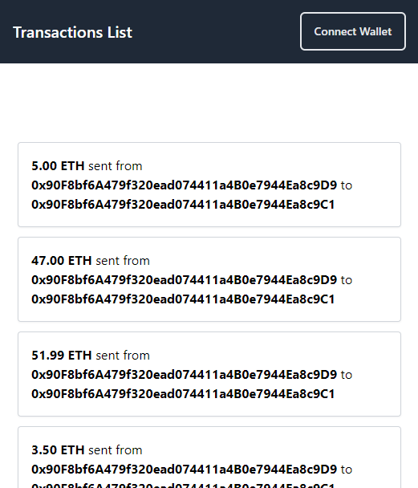
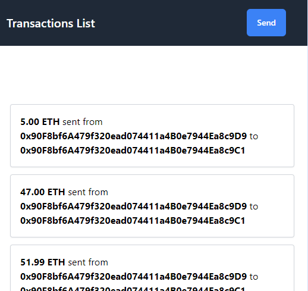
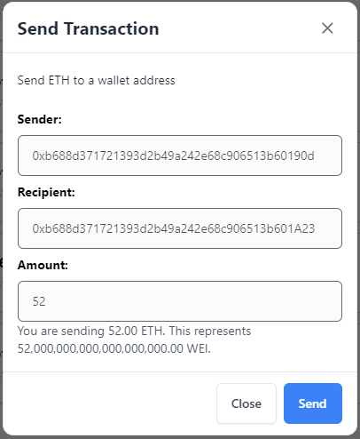
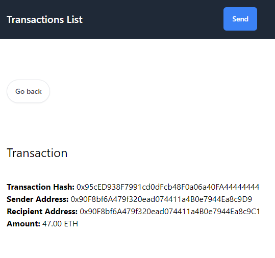
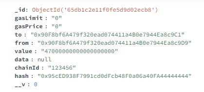

# Web App Developer Coding Challenge

This coding challenge is to fix several issues within a pre-existing application that simulates Ethereum native token transactions.

## Tech Stack

This app has been set up using the following tech stack:

- **Frontend:** `React` _(using `TypeScript`)_, `Redux`, `Apollo Client`, `Tailwind CSS`
- **Backend:** `Node.js` server, `GraphQL`, `MongoDB`
- **Blockchain:** Local `Ganache` Ethereum chain
- **Containerization:** `Docker`

## Setting up and Starting the Project

- Install Metamask web extension - Ganache network for local development and use provided keys to get some development Ethereum in wallet
- Running the docker containers: **`docker compose up --build`**
- Stopping the docker containers via: **`docker compose down`**

### Notes

When using the project on windows: before docker compose up --build, edit file docker_run.sh to be on EOL conversion = Unix(LF)

Mongo: option to adjust port to 27018:27017 to avoid any clash with local mongodb instance

## Accessing the Application

- Frontend: [http://localhost:3000](http://localhost:3000)
- GraphQL Playground: [http://localhost:4000/graphql](http://localhost:4000/graphql)

## Tasks and Resolution measures

Resolutions are flagged in the code with comments starting with 'AP-FIX'.

### 1. GraphQL Query

The transaction document has the fields: gasLimit, gasPrice, to, from, value, data, chainId, hash. Any other field inserted in the graphql string would result in a mismatch between query and schema and a graphql validation error.

Resolution: The GetAllTransactions query string had the additional field 'receipt' which was removed.

### 2. Wallet Connection

The metamask connection can be established usign different third parties. Here we are using Web3-Onboard. As per the [Metamask documentation](https://docs.metamask.io/wallet/how-to/use-sdk/3rd-party-libraries/web3-onboard/), the required packaged are: @web3-onboard/core, @web3-onboard/injected-wallets and @web3-onboard/metamask.

Resolution: Installation and import of the @web3-onboard/metamask, so we can instantiate the wallet with metamaskSDK, and pass this wallet in the wallets array of the Onboard options object.

### 3. Redux Saga

The **`SEND_TRANSACTION`** saga is in charge of processing a transaction request and saving it in the database. This process uses the ethers package but the process is failing at the sendTransaction stage.

Resolution: from the ethers' [source code](https://github.com/ethers-io/ethers.js/blob/master/packages/abstract-signer/src.ts/index.ts), the first step is to populate the transaction with signer.populateTransaction(transaction) so we added this step to the process.

### 4. Navigation & Redirection

On successful transaction, the app needs to navigate to the new transaction's location at /transaction/{hash}.

Resolution: these steps are added:

- Adding a dispatch action after the successful DB mutation to save the new transaction hash in the redux store (under transactionId)
- Monitoring the transactionId in the SendTransaction component. On population, navigate to the single transaction page for that transaction

### 5. Wire in the Form

The _Send_ button in the navigation bar opens a form to send a transaction with 3 inputs: sender, recipient, amount, but the form is not functional.

Resolution: these changes are applied:

- the inputs fields are made accessible (remove disabled attribute) and required
- the component is made responsible of monitoring the inputs' changes with the react hook useReducer
- the 'Send' button at the bottom of the form is swap to type submit for basic validation on required fields
- On send, further validation is applied to each field: sender and recipients values are expected to follow the format of a 42 hexadecimal string _(40 characters + the `0x` prefix)_, and the amount is required to be above 0. On validation fail, errors are reflected in the component state and corresponding error messages displayed under each input.
- On successful validation and dispatch, the modal is closed and inputs' values are reset.
- On Cancel or X button click, the modal is closed and inputs' values are reset.
- The sender field is prepopulated with the address of the connected wallet.
- The dispatch action is given a payload with the validated inputs so that the sendTransaction saga function has access to it and can populate transaction details accordingly.

### 6. UI

In the navigation bar, the "Connect Wallet" button and the 'Send' button disappear under certain screen widths (640px).

Resolution: the tailwind classes are changed on elements in the Navigation component so that it allows better flex behaviour, and the address box is hidden on small screens for a better navbar layout.

### 7. Human Readable Values

The transactions use the WEI unit but we want to display ETH for user experience so we want to convert the transaction values to a human-readable format _(from WEI to ETH)_. This is relevant for the transaction list, the single page transaction views and the form.

Resolution: setting up the relevant utils functions for conversion and using the numeral package, we can now pass the value in the correct unit and display the values in ETH on transaction cards and details, and display both as information to the user on the form.

Conversion display at bottom of form:

Transaction details on single transaction page:

Corresponding transaction in the DB:

## Submitting

Repo link to `webappdev@colony.io`
